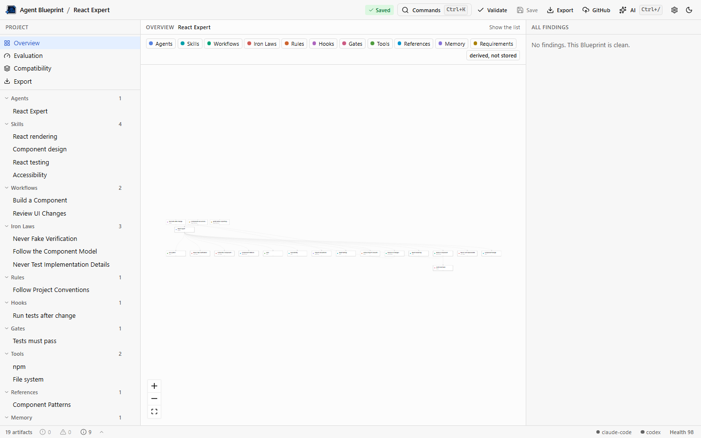
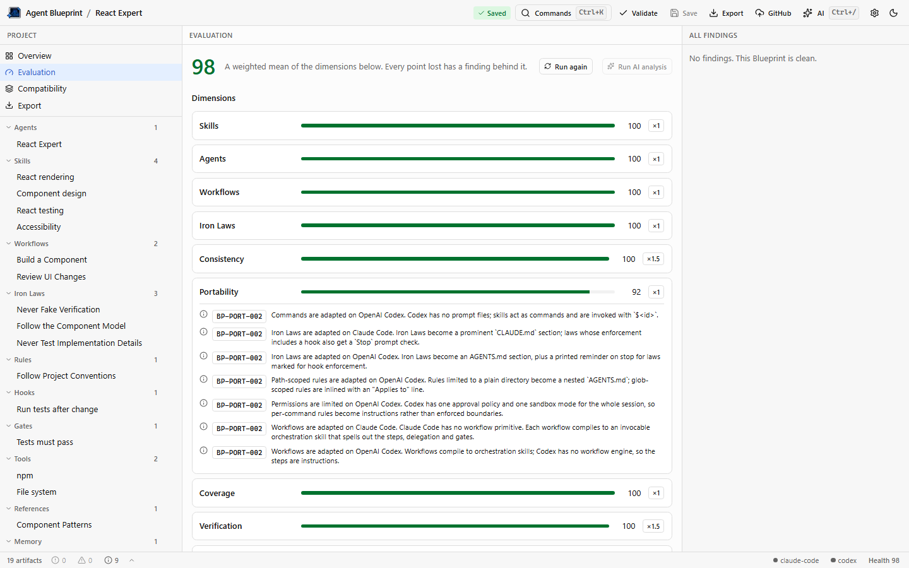
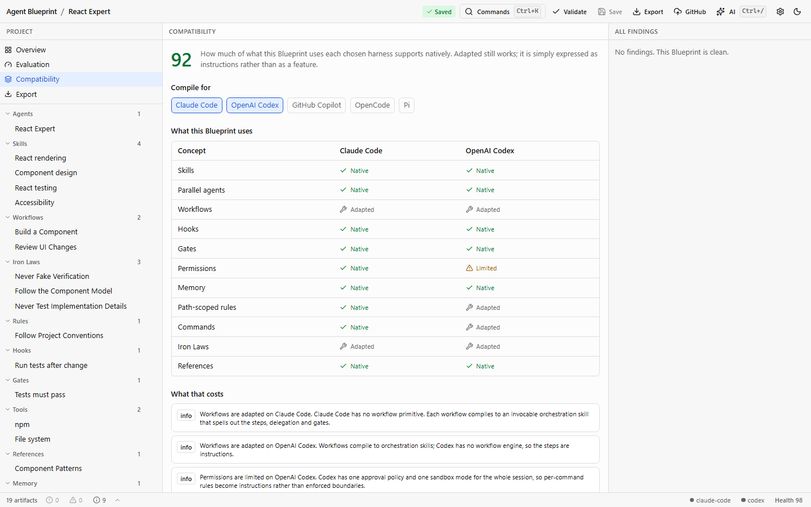

# Agent Blueprint

**Design once. Test it. Compile it everywhere.**

Agent Blueprint is a visual IDE for designing, validating and compiling AI agent systems. You
describe agents, skills, workflows, iron laws, rules, hooks, gates, tools, references and
memory once, as a _Blueprint_; the compiler turns that Blueprint into the files each AI coding
harness expects, and the validator tells you what is missing, contradictory or unsupported
before you ship it.

Everything happens in the browser. There is no server, no account and no database: a project
lives in IndexedDB, in a folder on your disk, in a ZIP, or in a Git repository, and the two
optional route handlers are stateless relays that exist only to work around browser limits.



## What it does

**Design.** Every artifact has a visual form and a source tab showing the project file itself,
with a Markdown preview. Workflows are edited as the drawing they are. A ten-step wizard builds
a first Blueprint from templates, and a command palette (`⌘K`) creates, navigates and validates.

**Validate.** Structural, semantic, orphan, contradiction and requirement rules, each with a
stable code and a navigable reference. The health bar opens the findings behind every count.



**Compile.** One Blueprint, five harnesses: Claude Code, OpenAI Codex, GitHub Copilot, OpenCode
and Pi. Each adapter maps what its harness can express and reports the rest as a compatibility
issue naming what was lost and where the intent was written instead. Generation is
deterministic: same Blueprint in, same bytes out.



**Ship.** Export a deterministic ZIP of the source and the compiled output, write to a folder,
or push to GitHub — one tree, one commit, never forced, with a preview of every path that would
be added, changed or removed, and a secret scan in front of it.

**Improve, optionally.** Bring your own OpenAI-compatible endpoint and the app can draft a
Blueprint, improve an artifact, find contradictions or give a second opinion on the score.
Every AI output is a ChangeSet reviewed field by field before anything is applied.

## Getting started

```bash
# Node 22 and pnpm 10 (corepack enable, or npm i -g pnpm)
pnpm install
pnpm check      # lint + typecheck + test, everything CI runs except the build
pnpm dev        # http://localhost:3000
```

Other useful commands:

```bash
pnpm build                                        # production build of apps/web
pnpm --filter web test:e2e                        # Playwright (once: playwright install chromium)
pnpm --filter web screenshots                     # regenerate docs/images
pnpm --filter @agent-blueprint/core test          # one package
pnpm format                                       # prettier
```

## The repository

| Path                 | Package                      | Role                                                                                   |
| -------------------- | ---------------------------- | -------------------------------------------------------------------------------------- |
| `apps/web`           | `web`                        | the Next.js IDE                                                                        |
| `packages/core`      | `@agent-blueprint/core`      | canonical model, project format, validation, evaluation, dependency graph, change-sets |
| `packages/exporters` | `@agent-blueprint/exporters` | the five harness adapters and the compile pipeline                                     |
| `packages/ai`        | `@agent-blueprint/ai`        | OpenAI-compatible client producing reviewable change-sets                              |
| `packages/templates` | `@agent-blueprint/templates` | 29 artifact templates and 10 starter blueprints                                        |
| `packages/fixtures`  | `@agent-blueprint/fixtures`  | sample projects used by tests everywhere                                               |
| `docs/`              |                              | the specification set                                                                  |

A project on disk is the source of truth, not an export of one:

```
blueprint/            the Blueprint: one Markdown or YAML file per artifact
CLAUDE.md .claude/    compiled for Claude Code
AGENTS.md .agents/    compiled, shared by Codex, Copilot, OpenCode and Pi
.codex/ .github/ .opencode/ .pi/    the rest of each harness's own tree
```

## Documentation

Start at [docs/00-vision.md](docs/00-vision.md) for what the words mean, then the document for
whatever you are changing: [architecture](docs/01-architecture.md),
[domain model](docs/02-domain-model.md), [project format](docs/03-project-format.md),
[compiler](docs/04-compiler.md), [validation and evaluation](docs/05-validation-evaluation.md),
[AI layer](docs/06-ai-layer.md), [web app](docs/07-web-app.md), [security](docs/08-security.md),
[roadmap](docs/09-roadmap.md), [decisions](docs/10-decisions.md), and a verified reference per
harness under [docs/harness/](docs/harness).

## Status

Phases P0 to P8 are complete: the model, the compiler, the templates, the web IDE, the graphs,
the trust surfaces, the AI layer, GitHub, and the hardening pass — all five adapters full,
binary assets carried end to end, the UI checked against WCAG 2.1 AA in both themes, a
200-artifact project measured rather than assumed, and the docs/00 story walked in one test.
[docs/09-roadmap.md](docs/09-roadmap.md) is the backlog and says what each phase actually built.

Working in this repository with an AI agent? Start at [AGENTS.md](AGENTS.md).
